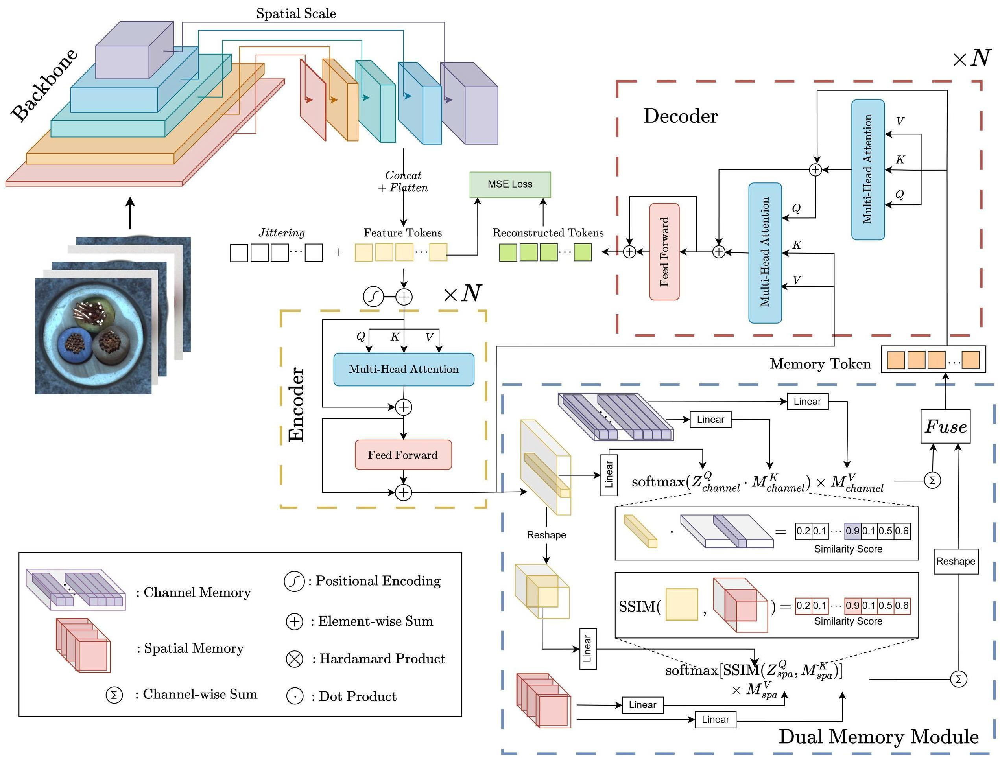

# A new Approach addressing Identical Shorcut problem in Anomaly Detection


## Architecture



## MVTec-AD
- **Create the MVTec-AD dataset directory**. Download the MVTec-AD dataset from [here](https://www.mvtec.com/company/research/datasets/mvtec-ad). Unzip the file and move some to `./data/MVTec-AD/`. The MVTec-AD dataset directory should be as follows. 

```
|-- data
    |-- MVTec-AD
        |-- mvtec_anomaly_detection
        |-- json_vis_decoder
        |-- train.json
        |-- test.json
```

## Results

### MVTec-AD Dataset Results

DuMeNet achieves state-of-the-art performance on the MVTec-AD dataset:

| Category | US | | PSVDD | | Padim | | Cutpaste | | MKD | | DRAEM | | Uniad | | Ours | |
|----------|-----|-----|-----|-----|-----|-----|-----|-----|-----|-----|------|-----|------|-----|------|-----|
| | Image | Pixel | Image | Pixel | Image | Pixel | Image | Pixel | Image | Pixel | Image | Pixel | Image | Pixel | Image | Pixel |
| Bottle | 84.0 | 67.9 | 85.5 | 86.7 | 97.9 | 98.1 | 67.9 | - | 98.7 | 91.8 | 97.5 | 87.6 | 99.7 | 96.5 | **100** | 97.7 |
| Cable | 60.0 | 78.3 | 64.4 | 62.2 | 70.9 | 81.0 | 69.2 | - | 78.2 | 89.3 | 57.8 | 71.3 | **95.2** | **97.3** | 89.4 | 93.8 |
| Capsule | 57.6 | 85.5 | 61.3 | 83.1 | 73.4 | 96.3 | 63.0 | - | 68.3 | 88.3 | 65.3 | 50.5 | 86.9 | **98.5** | 95.0 | 98.7 |
| Hazelnut | 95.8 | 93.7 | 83.9 | 97.4 | 85.5 | 96.3 | 80.9 | - | 97.1 | 91.2 | 93.7 | 96.9 | 99.8 | 98.1 | **100** | 97.9 |
| Metal Nut | 62.7 | 76.6 | 80.9 | **96.0** | 88.0 | 84.8 | 60.0 | - | 64.9 | 64.2 | 72.8 | 62.2 | 99.2 | 98.1 | **99.7** | 95.0 |
| Pill | 56.1 | 80.3 | 89.4 | 86.5 | 68.8 | 94.4 | 71.4 | - | 79.7 | 69.7 | 82.2 | 94.4 | 93.7 | 95.0 | **96.0** | 96.7 |
| Screw | 66.9 | 90.8 | 80.9 | 86.9 | 56.9 | 94.1 | 85.2 | - | 75.6 | 92.1 | 92.0 | 95.5 | 87.5 | 98.3 | **96.0** | **99.2** |
| Toothbrush | 57.8 | 86.9 | **99.4** | 98.0 | 95.3 | **98.8** | 63.9 | - | 75.3 | 88.9 | 90.6 | 97.7 | 94.2 | 98.4 | 93.9 | 98.2 |
| Transistor | 61.0 | 68.3 | 77.5 | 94.2 | 86.6 | 92.3 | 57.9 | - | 73.4 | 71.7 | 74.8 | 64.5 | **99.8** | **97.9** | 97.3 | 96.0 |
| Zipper | 78.6 | 84.2 | 77.8 | 95.1 | 79.7 | 94.8 | 93.5 | - | 87.4 | 86.1 | 98.8 | **98.3** | 95.8 | 96.0 | **99.1** | 98.3 |
| Carpet | 86.6 | 88.7 | 63.3 | 78.6 | 93.8 | 97.6 | 93.6 | - | 69.8 | 95.5 | 98.0 | **98.6** | **99.8** | 98.5 | 99.7 | 98.0 |
| Grid | 69.2 | 61.5 | 66.0 | 70.8 | 73.9 | 97.1 | 93.2 | - | 83.8 | 82.3 | 99.3 | **98.7** | 98.2 | 96.5 | 99.2 | 97.8 |
| Leather | 97.2 | 95.4 | 60.8 | 93.5 | **99.9** | 97.1 | 93.4 | - | 93.6 | 96.7 | 98.7 | 96.8 | **100** | **98.8** | **100** | 98.9 |
| Tile | 93.7 | 82.7 | 88.3 | 92.1 | 93.3 | 91.4 | 88.6 | - | 89.5 | 85.3 | **99.8** | **98.0** | 99.3 | 98.8 | 99.5 | 91.6 |
| Wood | 90.6 | 83.3 | 72.1 | 80.7 | 98.4 | 89.1 | 80.4 | - | 93.4 | 90.5 | 99.8 | **96.0** | 98.6 | 93.2 | 98.5 | 92.9 |
| **Mean** | 74.5 | 81.8 | 76.8 | 85.6 | 84.2 | 89.5 | 77.5 | - | 81.9 | 84.9 | 88.1 | 87.2 | 96.5 | **96.8** | **98.5** | 96.7 |


## Requirements

- Python 3.8+
- PyTorch 1.9+
- torchvision
- CUDA 11.1+ (for GPU acceleration)
- scikit-learn
- OpenCV
- numpy
- einops
- easydict
- pyyaml
- tensorboardX
- tabulate

## Usage

### Configuration

The framework uses a YAML configuration file to set parameters. Key configuration options include:

```yaml
net:
  - name: reconstruction
    prev: neck
    type: models.reconstructions.UniADMemory
    kwargs:
      memory_mode: 'both'  # Options: 'channel', 'spatial', 'both', 'none'
      fusion_mode: 'concat'  # Options: 'concat', 'add', 'multiply', 'attention', 'gate'
      channel_memory_size: 256
      spatial_memory_size: 256
```

### Training

To train the model on a specific class:

```bash
python tools/train_val.py --config tools/config.yaml --class_name bottle --single_gpu
```

For multi-class training:

```bash
python tools/train_single.py
```

### Evaluation

To evaluate a trained model:

```bash
python tools/train_val.py --config tools/config.yaml --class_name bottle --evaluate
```

